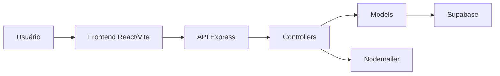

# Arquitetura do sistema

A aplicação segue uma arquitetura em camadas, separando a interface do usuário, as regras de negócio, o acesso aos dados e os serviços externos.

## Visão geral

* **Frontend:** React + Vite
* **Backend:** Node.js + Express
* **Modelos (Model):** acesso aos dados no Supabase
* **Banco de dados:** Supabase
* **Autenticação:** Supabase Authentication e middleware local
* **Envio de e-mail:** Nodemailer

## Fluxo de funcionamento

## Estrutura conceitual

* O frontend consome a API REST por meio de requisições HTTP.
* As rotas da API direcionam as requisições para os controllers.
* Os controllers realizam validações, autenticação e regras de negócio.
* Os models concentram o acesso aos dados e executam operações no Supabase.
* O Supabase é responsável pelo armazenamento de dados, autenticação e arquivos.
* O envio de e-mails é realizado pelo backend utilizando o Nodemailer.

## Organização do backend

A camada de backend é organizada de forma a separar responsabilidades:

* **Routes:** definem os endpoints da API.
* **Controllers:** recebem as requisições, aplicam regras de negócio e retornam as respostas HTTP.
* **Models:** concentram as operações de acesso ao banco de dados.
* **Middlewares:** realizam autenticação, autorização e tratamento de requisições.
* **Config:** reúne configurações da aplicação, como conexão com o Supabase.
* **Services:** implementam serviços auxiliares, quando necessários.

## Diagrama de casos de uso

O diagrama completo está disponível no README principal e pode ser incorporado em ferramentas de documentação técnica no futuro.
