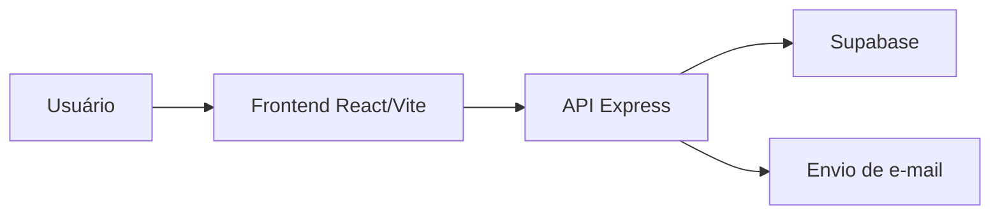

# Arquitetura do sistema

A aplicação segue uma arquitetura simples em camadas, com separação entre frontend, backend e banco de dados.

## Visão geral

- Frontend: React + Vite
- Backend: Node.js + Express
- Banco de dados: Supabase
- Autenticação: Supabase e middleware local
- Envio de e-mail: Nodemailer

## Fluxo de funcionamento

## Estrutura conceitual

- O frontend consome a API REST.
- O backend processa regras de negócio e validações.
- O Supabase é responsável por dados e autenticação.
- O fluxo de suporte utiliza e-mail externo por meio do backend.

## Diagrama de casos de uso

O diagrama completo está disponível no README principal e pode ser incorporado em ferramentas de documentação técnica no futuro.
