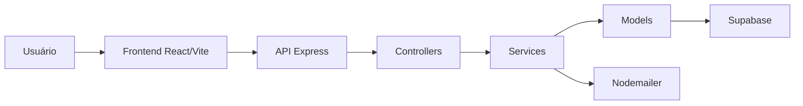

# Arquitetura do Sistema e Estratégia de Testes

Este documento detalha a organização estrutural, o fluxo de dados e a estratégia de testes da aplicação Tropa Livresca, cobrindo o ecossistema completo do Frontend ao Backend.

---

## Visão Geral da Tecnologia

* Frontend: React + Vite (Roteamento via React Router v6)
* Backend: Node.js + Express (API REST)
* Serviços (Services): Camada dedicada a regras de negócio e integrações
* Modelos (Models): Abstração de acesso estruturado aos dados
* Banco de Dados: Supabase (PostgreSQL)
* Autenticação: Supabase Authentication gerenciada por cookies HttpOnly no backend
* Envio de E-mail: Nodemailer
* Suíte de Testes: Módulo nativo node:test + supertest

---

## Fluxo de Funcionamento

O sistema adota uma arquitetura em camadas bem definida. O fluxo de uma requisição segue estritamente o caminho abaixo:

---

## Estrutura Conceitual

* Consumo de API: O frontend consome a API REST por meio de um utilitário centralizado chamado apiFetch. Este interceptador injeta as credenciais em todas as chamadas e gerencia de forma transparente a renovação de tokens (refresh token) e o redirecionamento de tela de acordo com o ator logado (/auth/login para Clients ou /auth/admin para Administradores).
* Roteamento e Infraestrutura: As rotas do backend direcionam as requisições HTTP e aplicam middlewares de interceptação global, tais como checkAuth (validação de sessão) e upload.single('imagem') (processamento de mídia via Multer).
* Intermediação HTTP: Os controllers recebem os dados vindos das requisições (req.body, req.params, req.query), delegam o processamento pesado para a camada de serviços e devolvem a resposta HTTP configurando cabeçalhos, status codes e cookies criptografados.
* Regras de Negócio (Services): Esta camada concentra as inteligências do sistema. Ela resolve cálculos de paginação, formatação de metadados, processamento de strings (como parsing de JSON em URLs de capas de livros) e trata erros específicos jogando exceções com códigos HTTP mapeados (ex: 404 para registros não encontrados).
* Abstração de Dados (Models): Concentra todas as operações e consultas brutas de banco de dados. Os models interagem diretamente com o cliente do Supabase, isolando o restante da aplicação da sintaxe específica do banco.
* Serviços Externos: O banco de dados Supabase gerencia a persistência de tabelas, autenticação nativa e armazenamento de mídias (Storage). Em paralelo, o backend consome o Nodemailer para disparar e-mails de chamados para o suporte.

---

## Organização do Backend

A estrutura de diretórios do servidor isola de forma estrita cada responsabilidade de desenvolvimento:

* routes/: Mapeia e define os endpoints expostos da API pública e privada.
* controllers/: Gerencia exclusivamente o ciclo de vida HTTP (req, res, next).
* middlewares/: Interceptores de segurança, uploads e o manipulador global de erros (errorHandler).
* services/: Centraliza o núcleo das lógicas de negócio e as orquestrações de regras.
* models/: Centraliza as queries, views e mutations de dados.
* config/: Arquivos de inicialização de infraestrutura (como conexões com o Supabase).

---

## Estratégia de Testes

A estabilidade e a integridade da aplicação são asseguradas por uma suíte de testes automatizados construída sem dependências pesadas, utilizando ferramentas integradas do ecossistema Node.js.

### 1. Testes de Integração (Routes & Controllers)
Focados em testar o comportamento dos endpoints de ponta a ponta a partir da camada HTTP.
* Ferramentas: supertest para simulação de requisições de rede.
* O que validam: Garantem que os status codes (200, 201, 400, 404, 500) retornem conforme o cenário. Validam se os cookies de sessão (auth-token e refresh-token) são injetados ou limpos corretamente e se os parâmetros de query e rota são devidamente higienizados e convertidos.
* Isolamento: Os middlewares originais e serviços são substituídos por dublês (mocks) em tempo de execução usando o recurso nativo mock.module do Node.js, isolando completamente o controlador de efeitos colaterais de rede ou upload de arquivos em disco.

### 2. Testes Unitários (Services & Helpers)
Focados em garantir que as funções lógicas funcionem perfeitamente diante de qualquer variação de dados.
* Ferramentas: node:test e node:assert.
* O que validam: Testam o processamento interno de métodos (como conversão de formatos de texto ou objetos). Garantem que os cálculos matemáticos de paginação de dados (cálculo de totalPages e totalItems) devolvam números exatos para o cliente.
* Isolamento: As chamadas para os modelos de dados (AuthModel, LivroModel, AutorModel) são interceptadas e mockadas com retornos falsos estruturados, permitindo testar caminhos de falhas no banco sem precisar se conectar a um banco real durante os testes.
