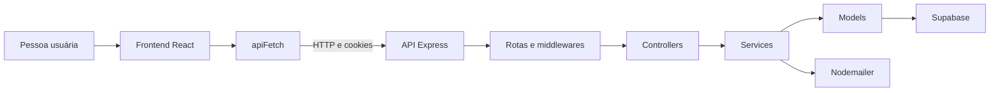

# Arquitetura do Sistema

Este documento descreve a estrutura atual da aplicação Tropa Livresca e o fluxo entre o frontend, a API e os serviços externos.

## Tecnologias

- Frontend: React 19, Vite 8 e React Router 7.
- Backend: Node.js e Express 5, organizados em workspaces npm.
- Persistência, autenticação e armazenamento: Supabase (PostgreSQL, Auth e Storage).
- E-mail: Nodemailer.
- Testes de integração da API: Jest, SWC e Supertest.

## Visão do sistema

```mermaid
flowchart LR
    U[Pessoa usuária] --> F[Frontend React]
    F --> AF[apiFetch]
    AF -->|HTTP e cookies| API[API Express]
    API --> R[Rotas e middlewares]
    R --> C[Controllers]
    C --> S[Services]
    S --> M[Models]
    M --> DB[Supabase]
    S --> E[Nodemailer]
```

Os módulos funcionais do backend seguem esse fluxo em camadas quando aplicável: as rotas conectam endpoints a middlewares e controllers; controllers tratam o ciclo HTTP; services coordenam regras de negócio; e models concentram operações de dados. A infraestrutura compartilhada fica em `backend/src/api/common`.

## Backend

O ponto de entrada `backend/src/api.js` configura CORS com credenciais, parsers JSON e URL-encoded, leitura de cookies e o tratamento global de erros. Ele monta os grupos de rotas versionados:

| Prefixo           | Responsabilidade                                                                     |
| ----------------- | ------------------------------------------------------------------------------------ |
| `/api/v1/clients` | Funcionalidades da área de clientes, como livros, perfil, endereços e loja.          |
| `/api/v1/admin`   | Funcionalidades administrativas, incluindo livros, revisão, usuários e notificações. |
| `/api/v1/auth`    | Autenticação e gerenciamento de sessão.                                              |

Os diretórios `backend/src/api/admin` e `backend/src/api/clients` agrupam os módulos de rotas por funcionalidade. Cada módulo pode conter arquivos `.route.js`, `.controller.js` e `.service.js`. Recursos compartilhados ficam em `backend/src/api/common`, dividido em `auth`, `config`, `middlewares`, `models` e `utils`.

## Frontend

O ponto de entrada `frontend/src/main.jsx` renderiza a aplicação, e `App.jsx` fornece os contextos de autenticação e administração. O roteador em `frontend/src/common/routes/RoutesApp.jsx` encaminha as páginas para as áreas administrativa, de autenticação e de clientes.

As funcionalidades são organizadas em `frontend/src/admin` e `frontend/src/clients`; elementos compartilhados, configuração e serviços ficam em `frontend/src/common`. O serviço `frontend/src/common/services/api.js` exporta `apiFetch`, usado para chamar a API com `credentials: "include"`. Em respostas 401, ele pode tentar renovar a sessão e redirecionar para a tela de login correspondente.

## Integração com serviços

O backend utiliza os clientes do Supabase configurados em `backend/src/api/common/config` para acessar os serviços de dados. Middlewares compartilhados tratam autenticação e erros; módulos que recebem arquivos podem usar Multer e o armazenamento do Supabase. O Nodemailer é usado nos fluxos que precisam enviar e-mails.

## Testes de integração

Os testes HTTP ficam em `backend/tests/integration/routes`, organizados por área (`admin` e `clients`). Jest executa os testes no ambiente Node.js com transformação via SWC, e Supertest faz requisições às aplicações Express montadas para cada teste. Helpers, fixtures e mocks de serviços externos ficam nas pastas correspondentes de `backend/tests`.
